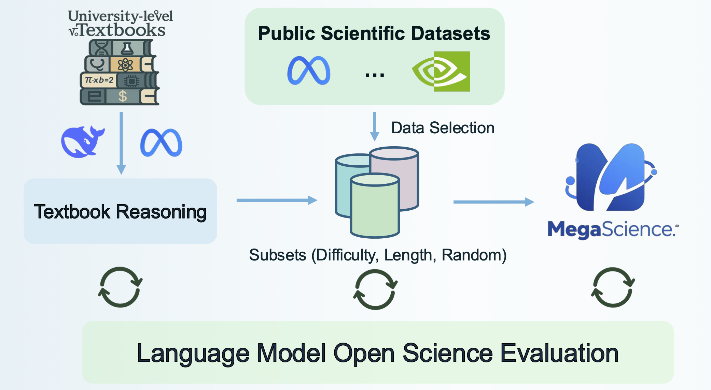
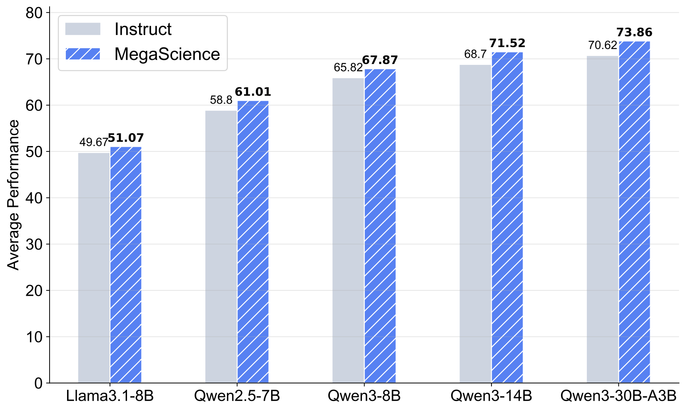

<div align="center">
<h1> MegaScience: Pushing the Frontiers of Post-Training<br>
Datasets for Science Reasoning
</h1>
</div>

<div align="center">
    
[](https://arxiv.org/abs/2507.16812)
[-violet?style=for-the-badge&logo=huggingface&logoColor=%23FFD21E&logoSize=30&link=https%3A%2F%2Fhuggingface.co%2FMegaScience
)](https://huggingface.co/MegaScience)
[](https://github.com/GAIR-NLP/lm-open-science-evaluation)

</div>


## 🔥 News
- **[2025-07-23]** 🎉🎉🎉 We release our detailed technical report on [**arXiv**](https://arxiv.org/abs/2507.16812), datasets and models trained on MegaScience on [**HuggingFace**](https://huggingface.co/MegaScience), and evaluation system on [**Github**](https://github.com/GAIR-NLP/lm-open-science-evaluation).

## 💎 Resources

| Dataset Name      | HuggingFace Link                                              | Size    | License                                                      |
|-----------------|-----------------------------------------------------------------| ------- | ------------------------------------------------------------ |
| **TextbookReasoning** | [🤗 MegaScience/TextbookReasoning](https://huggingface.co/datasets/MegaScience/TextbookReasoning) | 0.65 million | [CC-BY-NC-SA-4.0](https://spdx.org/licenses/CC-BY-NC-SA-4.0) |
| **MegaScience** | [🤗 MegaScience/MegaScience](https://huggingface.co/datasets/MegaScience/MegaScience) | 1.25 million | [CC-BY-NC-SA-4.0](https://spdx.org/licenses/CC-BY-NC-SA-4.0) |

| Model Name      | HuggingFace Checkpoint                                          | Size    | License                                                      |
|-----------------|-----------------------------------------------------------------| ------- | ------------------------------------------------------------ |
| Qwen3-30B-A3B-MegaScience | [🤗 MegaScience/Qwen3-30B-A3B-MegaScience](https://huggingface.co/MegaScience/Qwen3-30B-A3B-MegaScience) | 30B | [apache-2.0](https://choosealicense.com/licenses/apache-2.0/) |
| Qwen3-14B-MegaScience | [🤗 MegaScience/Qwen3-14B-MegaScience](https://huggingface.co/MegaScience/Qwen3-14B-MegaScience) | 14B | [apache-2.0](https://choosealicense.com/licenses/apache-2.0/) |
| Qwen3-8B-MegaScience | [🤗 MegaScience/Qwen3-8B-MegaScience](https://huggingface.co/MegaScience/Qwen3-8B-MegaScience) | 8B | [apache-2.0](https://choosealicense.com/licenses/apache-2.0/) |
| Qwen3-4B-MegaScience | [🤗 MegaScience/Qwen3-4B-MegaScience](https://huggingface.co/MegaScience/Qwen3-4B-MegaScience) | 4B | [apache-2.0](https://choosealicense.com/licenses/apache-2.0/) |
| Qwen3-1.7B-MegaScience | [🤗 MegaScience/Qwen3-1.7B-MegaScience](https://huggingface.co/MegaScience/Qwen3-1.7B-MegaScience) | 1.7B | [apache-2.0](https://choosealicense.com/licenses/apache-2.0/) |
| Qwen2.5-7B-MegaScience | [🤗 MegaScience/Qwen2.5-7B-MegaScience](https://huggingface.co/MegaScience/Qwen2.5-7B-MegaScience) | 7B | [apache-2.0](https://choosealicense.com/licenses/apache-2.0/) |
| Qwen2.5-3B-MegaScience | [🤗 MegaScience/Qwen2.5-3B-MegaScience](https://huggingface.co/MegaScience/Qwen2.5-3B-MegaScience) | 3B | [apache-2.0](https://choosealicense.com/licenses/apache-2.0/) |
| Qwen2.5-1.5B-MegaScience | [🤗 MegaScience/Qwen2.5-1.5B-MegaScience](https://huggingface.co/MegaScience/Qwen2.5-1.5B-MegaScience) | 1.5B | [apache-2.0](https://choosealicense.com/licenses/apache-2.0/) |
| Llama3.1-8B-MegaScience | [🤗 MegaScience/Llama3.1-8B-MegaScience](https://huggingface.co/MegaScience/Llama3.1-8B-MegaScience) | 8B | [llama3.1](https://huggingface.co/meta-llama/Llama-3.1-70B-Instruct/blob/main/LICENSE) |


## 🚀 Introduction



To develop AI scientists and support human researchers in advancing the frontiers of natural science discovery, we first present **TextbookReasoning**, an open dataset featuring truthful reference answers extracted from 12k university-level scientific textbooks, comprising 650k reasoning questions spanning 7 scientific disciplines. We further introduce **MegaScience**, a large-scale mixture of high-quality open-source datasets totaling 1.25 million instances, developed through systematic ablation studies that evaluate various data selection methodologies to identify the optimal subset for each publicly available scientific dataset. Meanwhile, we build a comprehensive evaluation system covering diverse subjects and question types across 15 benchmarks, incorporating comprehensive answer extraction strategies to ensure accurate evaluation metrics. Models trained on MegaScience significantly outperform their respective official Instruct counterparts on scientific reasoning tasks. Notably, MegaScience-trained models consistently surpass the strong Qwen3-Instruct baselines, even when fine-tuned on the state-of-the-art Qwen3 models. Furthermore, MegaScience exhibits strong scalability: as the base model size increases, the performance gains from MegaScience become more pronounced.

We have fully open-sourced MegaScience and all its associated components, including the data construction pipeline, scientific reasoning evaluation system, dataset corpus, and models trained on the dataset. We hope this systematic and high-quality resource will support the research community and further accelerate the development and application of general-purpose AI in science.



## ⚙️ Data Process Pipeline

### Step 0. Install Environment

```bash
cd data_process
conda create --name megascience python=3.10
conda activate megascience
pip install -r requirements.txt
pip install flash-attn --no-build-isolation
pip install -U pynvml
```

Launch the Python interpreter and download the necessary NLTK tokenizer data:

```python
python -c "import nltk; nltk.download('punkt_tab')"
```

Alternatively, you can run this interactively:
```python
python
>>> import nltk
>>> nltk.download('punkt_tab')
>>> exit()
```

### Step 1. PDF Digitalization

We utilize [olmOCR](https://github.com/allenai/olmocr) to convert PDF documents into text format. Please follow the [olmOCR documentation](https://github.com/allenai/olmocr) to process your PDFs, then segment the resulting documents into 4096-token chunks and store them in the `text` field.

### Step 2: QA Extraction

Configure the QA extraction process by modifying `data_process/vllm_inference/task_config/extract_qa.yaml`. Set the following parameters:
- Model path
- Number of GPUs
- Input data path
- Prompt path
- Save path

Execute the extraction script:
```bash
bash script/extract_qa.sh
```

After extraction completes, run the post-processing step to finalize the QA pairs:
```bash
python vllm_inference/extract_qa_postprocess.py 
    --input data/extract_qa/original_qa \
    --output data/extract_qa/final_qa/extract_qa.jsonl \
    --document_save_path data/extract_qa/final_qa/documents.jsonl
```
### Step 3. Question Deduplication

We employ [text-dedup](https://github.com/ChenghaoMou/text-dedup) to remove duplicate questions from the extracted dataset. This tool provides efficient text deduplication capabilities using various algorithms including MinHash, SimHash, and exact hash matching.

#### Environment Setup

First, create and activate a dedicated conda environment:
```bash
conda create --name textdedup python=3.10
conda activate textdedup
pip install text-dedup
```

#### Configuration

Configure the deduplication parameters in the script:
```bash
script/question_dedup.sh
```

#### Execution

Run the deduplication script:
```bash
bash script/question_dedup.sh
```

#### Output

After processing, merge all deduplicated chunks into a single JSONL file for downstream use.

### Step 4. QA Refinement

Configure the QA refinement process by modifying `data_process/vllm_inference/task_config/refine_qa.yaml`.

Execute the extraction script:

```bash
bash script/refine_qa.sh
```

After refinement completes, run the post-processing step to finalize the refined QA pairs:

```bash
python vllm_inference/refine_qa_postprocess.py \
    --input_dir data/refine_qa/original_data \
    --output_file data/refine_qa/final_data/refined_qa.jsonl
```

### Step 5. CoT Augmentation

#### Find no CoT data (judge CoT)

Configure the CoT judgement process by modifying `data_process/vllm_inference/task_config/judge_cot.yaml`.

Execute the extraction script:

```bash
bash script/judge_cot.sh
```

After refinement completes, run the post-processing step to finalize the QA pairs with CoT and no CoT:

```bash
python vllm_inference/judge_cot_postprocess.py \
    --input_file data/augment_cot/judge_cot/original_data \
    --output_cot data/augment_cot/judge_cot/final_data/cot_data.jsonl \
    --output_no_cot data/augment_cot/judge_cot/final_data/no_cot_data.jsonl
```

#### Distill CoT for no CoT data

Configure the CoT distillation process by modifying `data_process/vllm_inference/task_config/distill_cot.yaml`.

Execute the extraction script:

```bash
bash script/distill_cot.sh
```

After distillation completes, run the post-processing step to finalize the QA pairs:

```bash
python vllm_inference/distill_cot_postprocess.py \
    --input_no_cot_dir data/augment_cot/distill_cot/original_data \
    --input_cot_file data/augment_cot/judge_cot/final_data/cot_data.jsonl \
    --output data/augment_cot/distill_cot/final_data/refined_augmented_cot_qa.jsonl
```

### Step 6. QA Filtering

Configure the QA filtering process by modifying `data_process/vllm_inference/task_config/filter_qa.yaml`.

Execute the extraction script:

```bash
bash script/filter_qa.sh
```

After filtering completes, run the post-processing step to finalize the QA pairs:

```bash
python vllm_inference/filter_qa_postprocess.py \
    --input_dir data/filter_qa/original_data \
    --output_file data/filter_qa/final_data/refined_augmented_cot_filtering_qa.jsonl
```

### Step 7. LLM-based Question Decontamination

To ensure data quality and prevent benchmark contamination, we implement a comprehensive decontamination pipeline using embedding-based similarity search followed by LLM-based semantic judgment.

#### Generate Benchmark Embeddings

First, generate embeddings for benchmark questions to create a searchable index:

```bash
python decontamination/benchmark_index_save.py \
    --model BAAI/bge-large-en-v1.5 \
    --batch_size 1024 \
    --output_path decontamination/index/benchmark_embedding.jsonl
```

#### Generate Dataset Embeddings

Generate embeddings for your dataset questions:

```bash
python decontamination/data_index_save.py \
    --model BAAI/bge-large-en-v1.5 \
    --batch_size 1024 \
    --input_path data/filter_qa/final_data/refined_augmented_cot_filtering_qa.jsonl \
    --output_path decontamination/index/data_embedding.jsonl
```

#### Similarity Search

Perform vector similarity search to identify potentially similar questions between your dataset and benchmark:

```bash
python decontamination/vector_search.py \
    --data_embedding_path decontamination/index/data_embedding.jsonl \
    --benchmark_embedding_path decontamination/index/benchmark_embedding.jsonl \
    --output_path decontamination/results/refined_augmented_cot_filtering_qa_with_top5_similarity_benchmark.jsonl
```

#### LLM-based Similarity Judge

Configure the decontamination process by modifying the task configuration:g `data_process/vllm_inference/task_config/llm_based_decontamination.yaml`.

Execute the LLM-based similarity judgment:

```bash
bash script/llm_based_decontamination.sh
```

After the LLM judgment completes, run the post-processing step to generate the final decontaminated dataset:

```bash
python vllm_inference/llm_based_decontamination_postprocess.py \
    --input_data_dir data/llm_based_decontamination/original_data \
    --output_path data/llm_based_decontamination/final_data/refined_augmented_cot_filtering_qa_decontamination.jsonl
```

> **Note**: Our open-source code does not include OlympicArena benchmarks since their test sets are not publicly available. However, we have internally performed decontamination against [OlympicArena](https://github.com/GAIR-NLP/OlympicArena) to ensure there is no data overlap between our dataset and this benchmark.

### Step 8. Reference Answer Extraction

Configure the reference answer extraction process by modifying `data_process/vllm_inference/task_config/extract_reference_answer.yaml`.

Execute the extraction script:

```bash
bash script/extract_reference_answer.sh
```

After extraction completes, run the post-processing step to finalize the QA pairs:

```bash
python vllm_inference/extract_reference_answer_postprocess.py \
    --input_data_dir data/extract_reference_answer/original_data \
    --output_path data/extract_reference_answer/final_data/refined_augmented_cot_filtering_qa_decontamination_reference_answer.jsonl
```

### Step 9. Data Finalization

Transform the processed data into the final standardized format with the following structure:

```json
{
    "question": "Your question text here",
    "answer": "Your answer text here", 
    "subject": "Subject category",
    "reference_answer": "Reference answer text here"
}
```

Execute the finalization process using the command below:

```bash
python finalize_data.py \
    --input_path data/extract_reference_answer/final_data/refined_augmented_cot_filtering_qa_decontamination_reference_answer.jsonl \
    --output_path data/final_data.jsonl
```

## 🏋️ Supervised Finetuning

We utilize [LLaMA-Factory](https://github.com/hiyouga/LLaMA-Factory) to fine-tune the base models using our finalized dataset.

Please refer to the [LLaMA-Factory documentation](https://llamafactory.readthedocs.io/en/latest/) for detailed setup and usage instructions.

Our training configuration is located at:
```
supervised_finetuning/training_config.yaml
```

To get started with fine-tuning:

1. **Installation**: Follow the [installation guide](https://github.com/hiyouga/LLaMA-Factory#installation) to set up LLaMA-Factory
2. **Configuration**: Use our provided training config file as a starting point
3. **Execution**: Run the fine-tuning process according to the LLaMA-Factory documentation

## 🎯 Evaluation

We utilize the [Language Model Open Science Evaluation](https://github.com/GAIR-NLP/lm-open-science-evaluation) to evaluate our models on various scientific benchmarks.

Additionally, we evaluate our models on [OlympicArena](https://github.com/GAIR-NLP/OlympicArena), a comprehensive benchmark for multi-discipline cognitive reasoning. Since the test set answers are not publicly available, please follow the [OlympicArena submission guidelines](https://github.com/GAIR-NLP/OlympicArena#submit-your-result) to submit your results for evaluation.

To reproduce our evaluation results:

1. **Set up the environment**: First, follow the instructions in [Language Model Open Science Evaluation](https://github.com/GAIR-NLP/lm-open-science-evaluation) to deploy the evaluation environment.

2. **Run evaluation**: Execute the following script with your model path:

```bash
bash scripts/eval_science.sh <model_path>
```

3. **OlympicArena evaluation**: For OlympicArena evaluation, refer to their [documentation](https://github.com/GAIR-NLP/OlympicArena) for detailed instructions on running inference and submitting results.

## ❤️ Acknowledgement

This repo benefits from [olmOCR](https://github.com/allenai/olmocr), [text-dedup](https://github.com/ChenghaoMou/text-dedup), [LLaMA-Factory](https://github.com/hiyouga/LLaMA-Factory), [OlympicArena](https://github.com/GAIR-NLP/OlympicArena), and [Language Model Open Science Evaluation](https://github.com/GAIR-NLP/lm-open-science-evaluation). Thanks for their wonderful works.

## 😋 Projects Using MegaScience
- [Hybrid Reinforcement: When Reward Is Sparse, It's Better to Be Dense](https://arxiv.org/abs/2510.07242)
- [OpenRubrics: Towards Scalable Synthetic Rubric Generation for Reward Modeling and LLM Alignment](https://arxiv.org/abs/2510.07743)
- [ARES: Multimodal Adaptive Reasoning via Difficulty-Aware Token-Level Entropy Shaping](https://arxiv.org/abs/2510.08457)
- [Demystifying Reinforcement Learning in Agentic Reasoning](https://arxiv.org/abs/2510.11701)
- [Scaling Code-Assisted Chain-of-Thoughts and Instructions for Model Reasoning](https://arxiv.org/abs/2510.04081)
- [AgentFrontier: Expanding the Capability Frontier of LLM Agents with ZPD-Guided Data Synthesis](https://arxiv.org/abs/2510.24695)
- [MiroThinker: Pushing the Performance Boundaries of Open-Source Research Agents via Model, Context, and Interactive Scaling](https://www.arxiv.org/abs/2511.11793)
- [DR Tulu: Reinforcement Learning with Evolving Rubrics for Deep Research](https://allenai.org/blog/dr-tulu)
- [SkyRL-Agent: Efficient RL Training for Multi-turn LLM Agent](https://arxiv.org/abs/2511.16108)

## 🥳 Citation

If you find this work useful, please cite:

```
@article{fan2025megascience,
  title={MegaScience: Pushing the Frontiers of Post-Training Datasets for Science Reasoning},
  author={Fan, Run-Ze and Wang, Zengzhi and Liu, Pengfei},
  year={2025},
  journal={arXiv preprint arXiv:2507.16812},
  url={https://arxiv.org/abs/2507.16812}
}
```
